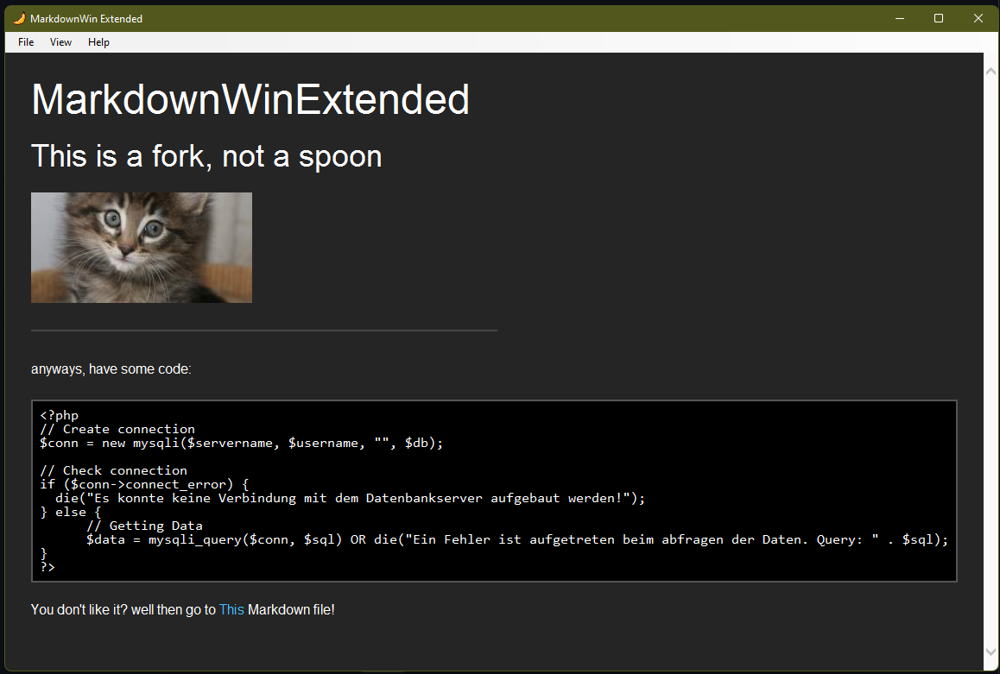

# MarkdownWinExtended

## Extended?
Yes, I extended this fork with some handy features I needed for how I want to use this software.

### Extensions:
* Command Line Arguments for opening markdown files and setting window title
* Rewrote Navigation to support markdown files with relative paths (relative from where the application is)
* A modified version of MarkdownSharp was used to support codeblocks [modified MarkdownSharp](https://www.nuget.org/packages/MarkdownSharp-GithubCodeBlocks)
* CSS has been edited to sans-serif and DarkMode
* I changed the icon to a banana. Yes I did that, nevermind the reason.

### How to use CMD arguments
You can either do:

`MarkdownWin "path-to-md"` to just open md \
or \
`MarkdownWin "path-to-md" "window-title"` to open md and set window title \
or \
`MarkdownWin "" "window-title"` to just set window title (actually that doesn't work yet, but it might soon)

(This command only works when the application name matches and you are in the same directory as the application. Unless you make a PATH entry or something)

### Rewrote navigation
The navigation now allows you to link other .md files relative to the applications directory.
So if the MarkdownWin is in a folder, in which is another folder called cool, in which is a md file called bruh.md, you can call it with the path *cool/bruh.md*. Normal web URLs are now opened externally in your default Web Browser

### So what does it look like now?
Well have a look:

---

# MarkdownWin
*A [Markdown](http://daringfireball.net/projects/markdown/) editor with live-preview for Windows.*

**Download the binary by tapping [right here](https://github.com/jpoehls/MarkdownWin/raw/master/dist/MarkdownWin.exe).**

I built this because [MarkedApp](http://www.markedapp.com) isn't available for Windows.
Like MarkedApp, MarkdownWin will monitor a file for changes and keep the live preview
in sync with your file. You can use whatever editor you want.

We use [MarkdownSharp](http://code.google.com/p/markdownsharp/) to render the live preview.

### Features

* Preview your Markdown file live, while you edit it.
* Copy the HTML source to your clipboard with `CTRL+C`.
* Print it with `CTRL+P`.
* Float the preview window on top of other applications for easy viewing.

**Dev Requirements**  
VS 2010, NuGet

Run `psake.bat` to build for release and update the `/dist` folder.

**Notes**

*The icon was borrowed without permission from [dashkards.com](http://dashkards.com).*

*ICO created with [converticon.com](http://converticon.com).*
